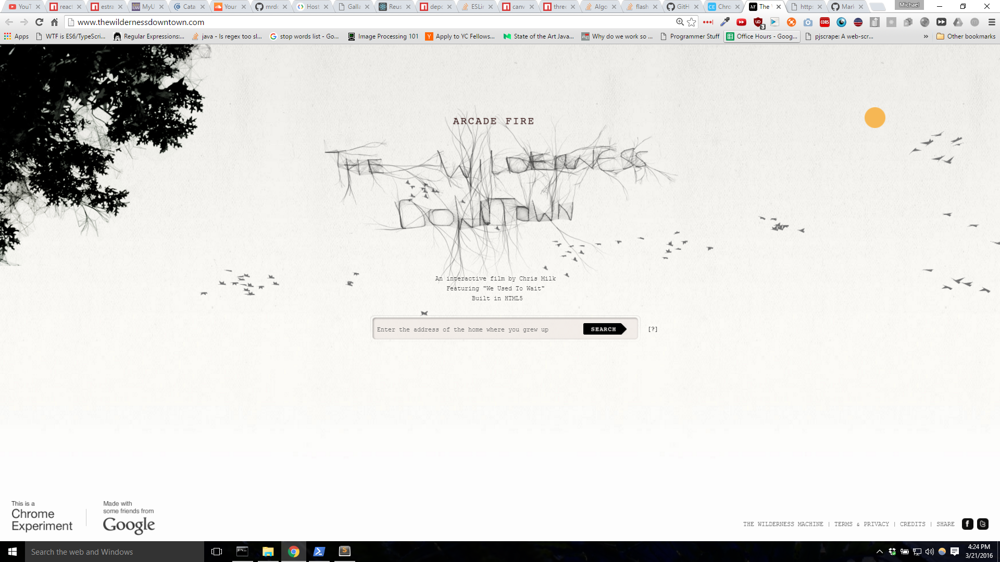

# react-birds

## Synopsis
Extracted React Component for the birds on this [chrome experiment](http://www.thewildernessdowntown.com/)


## Code Example
Add Three.JS to your web project `<script src="https://ajax.googleapis.com/ajax/libs/threejs/r69/three.min.js"></script>`

Download from NPM `npm install react-birds --save`

Then include the component into your react like so:
```javascript
'use strict';

import React from 'react';
import ReactDOM from 'react-dom';
import Birds from 'react-birds';

ReactDOM.render(
    <Birds />, // Render Component
    document.getElementById('entry')
);
```

## Motivation
These birds gave the website neat aesthetic feel; therefore, I abstracted the birds to their own component.

